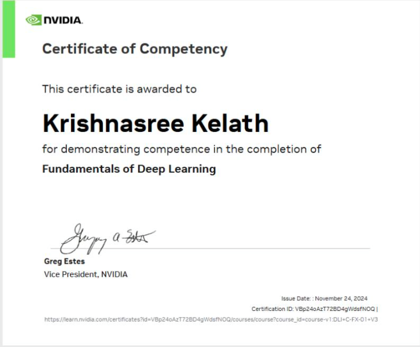
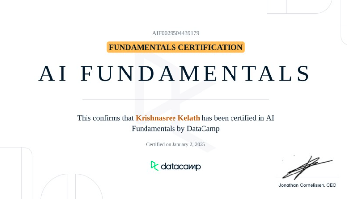
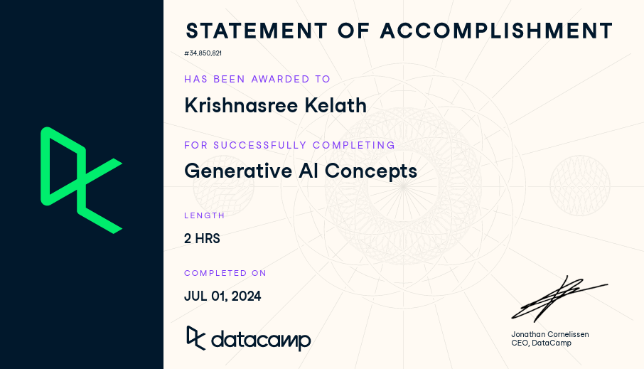
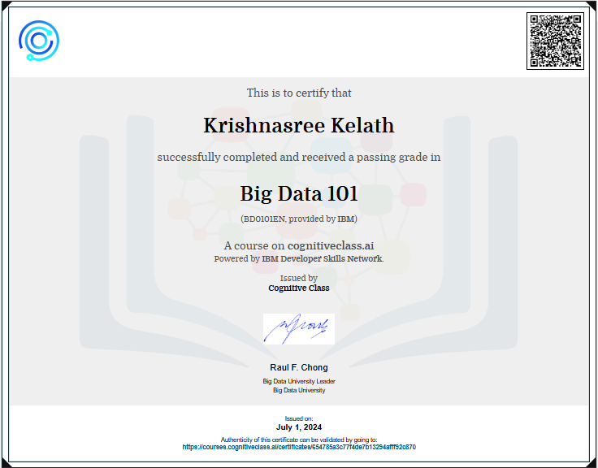
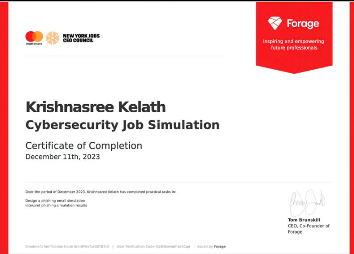
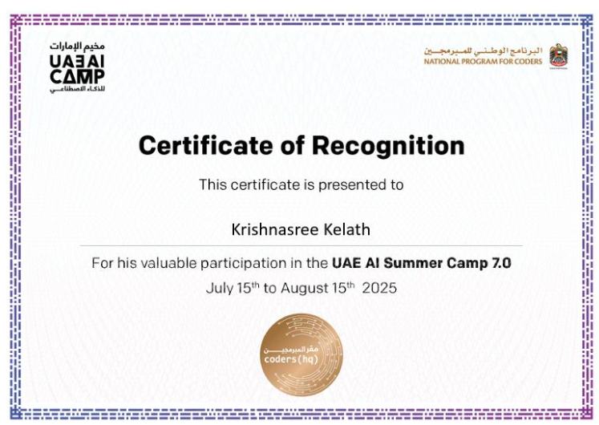
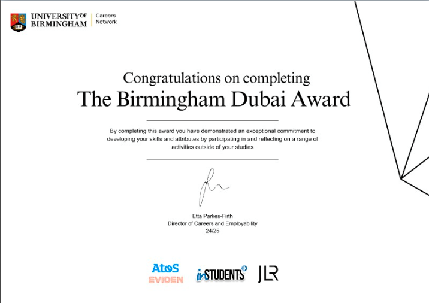
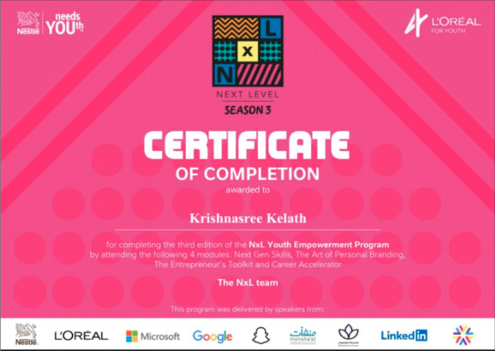

# Certifications & Awards

---

## Technical & AI

**Fundamentals of Deep Learning**
NVIDIA · Nov 2024 · Credential ID: 1tO0Ys3ITkGJkXM3sgBKrQ

---

**AI Fundamentals**
DataCamp · Jan 2025

---

**Generative AI Concepts**
DataCamp · Jul 2024

---

**Big Data (IBM BD0101EN)**
IBM / Cognitive Class · Jul 2024

---

## Cybersecurity

**DIFC Cyber Essentials: Navigating Compliance with NIST and ISR**
DIFC Academy · Aug 2024
Skills: NIST, Risk Assessment, Compliance Management

---

**Cybersecurity Job Simulation**
Mastercard / Forage · Dec 2023
Skills: Cybersecurity Incident Management, Cyber Defence

---

## Awards & Recognition

**UAE AI Camp Speaker Certificate**
UAE AI Camp · Aug 2025
Issued for delivering a public talk on AI, creativity, and consciousness at the UAE AI Camp (Coders HQ).

---

**The Birmingham Dubai Award**
University of Birmingham Dubai · Mar 2025

---

**NxL Youth Empowerment Programme**
L'Oreal · Dec 2024

---

## Music

**Distinction — Graded Examinations in Music Performance (Piano)**
Trinity College London
